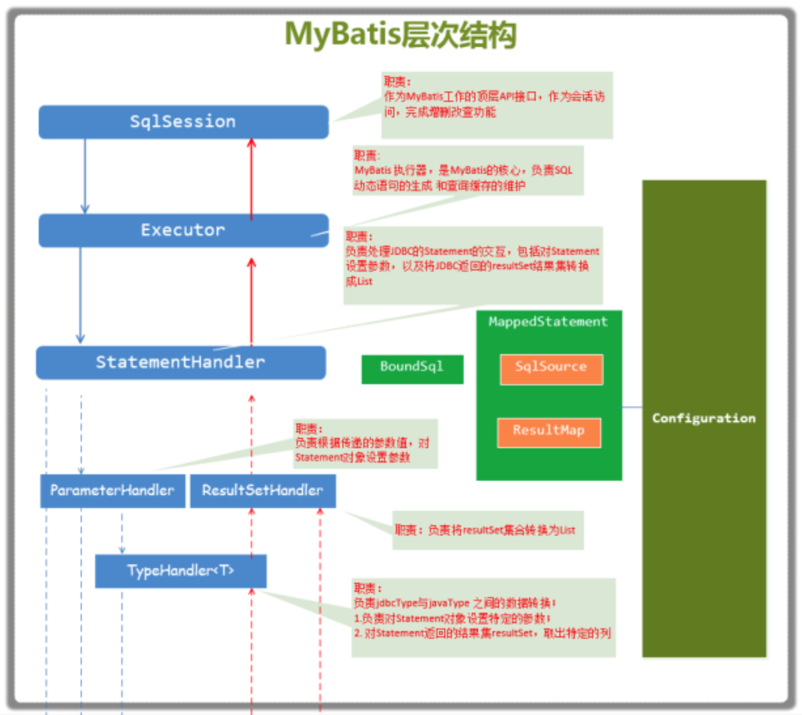

# MyBatis

## 概念

MyBatis是一款持久层框架，支持半自动 ORM，因为不能自动生成 SQL。它支持定制化SQL、存储过程以及高级映 射。MyBatis避免了几乎所有的JDBC代码和手动设置参数以及获取结果集。MyBatis可以使用简单的 XML或注解来配置和映射原生类型、接口和Java的POJO (Plain Old Java Objects,普通老式Java对 象) 为数据库中的记录。

> 半自动 ORM：Hibernate 属于全自动 ORM 映射工具，使用 Hibernate 查询关联对象或者关联集合对象时，可以根据对象关系模型直接获取，所以它是全自动的。而 Mybatis 在查询关联对象或关联集合对象时，需要手动编写 sql 来完成，所以，称之为半自动 ORM 映射工具。

### 原始JDBC操作 sql 方式

```
    public static void main(String[] args) {
        Connection connection = null;
        PreparedStatement preparedStatement = null;
        ResultSet resultSet = null;
        try {
            // 加载数据库驱动 Class.forName("com.mysql.jdbc.Driver"); // 通过驱动管理类获取数据库链接
            connection = (Connection) DriverManager.getConnection("jdbc:mysql://47.100.102.7:3306/zdy_mybatis?characterEncoding=utf-8", "root", "root");
            // 定义sql语句?表示占位符
            String sql = "select * from user where username = ?";
            // 获取预处理statement
            preparedStatement = (PreparedStatement) connection.prepareStatement(sql);
            // 设置参数，第一个参数为sql语句中参数的序号(从1开始)，第二个参数为设置的参数值
            preparedStatement.setString(1, "tom");
            // 向数据库发出sql执行查询，查询出结果集
            resultSet = preparedStatement.executeQuery(); // 遍历查询结果集
            while (resultSet.next()) {
                int id = resultSet.getInt("id");
                String username = resultSet.getString("username"); // 封装User
                User user = new User();
                user.setId(id);
                user.setUsername(username);
                System.out.println(user);
            }
        } catch (Exception e) {
            e.printStackTrace();
        } finally { // 释放资源
            if (resultSet != null) {
                try {
                    resultSet.close();
                } catch (SQLException e) {
                    e.printStackTrace();
                }
            }
            if (preparedStatement != null) {
                try {
                    preparedStatement.close();
                } catch (SQLException e) {
                    e.printStackTrace();
                }
            }
            if (connection != null) {
                try {
                    connection.close();
                } catch (SQLException e) {
                    e.printStackTrace();
                }
            }
        }
    }
```

### MyBatis 操作 sql

```
    public void test() throws Exception {
        InputStream resourceAsSteam = Resources.getResourceAsSteam("sqlMapConfig.xml");
        SqlSessionFactory sqlSessionFactory = new SqlSessionFactoryBuilder().build(resourceAsSteam);
        SqlSession sqlSession = sqlSessionFactory.openSession();
        //调用
        IUserDao userDao = sqlSession.getMapper(IUserDao.class);
        List<User> all = userDao.findAll();
        for (User user : all) {
            System.out.println(user);
        }
    }
```

## 核心功能

通过配置XML或注解来配置和映射原生类型、接口和Java的POJO为数据库中的记录。

## 其他功能（包含 MyBatis-Plus）

 - 缓存
 - 注解方式
 - 延迟加载
 - 插件（拦截器）
   - 乐观锁插件
   - 执行分析插件
   - 性能分析插件
 - sql注入器
 - 逻辑删除
 - 代码生产器

## 原理

所有 sql 由 mappedStatementMap 统一维护，根据 statementId 可获取到 sql。

使用动态代理实现 mapper 方式，可以不实现 dao 接口，根据声明的类型调用 sql。

SqlSession 和 Executor 实现了如何调用并执行 sql 的方法。

### 架构设计


### 层次结构



### 主要构件及相互作用

 - SqlSession 
   - 作为MyBatis⼯作的主要顶层API，表示和数据库交互的会话，完成必要数 据库增删改查功能 
 - Executor 
   - MyBatis执⾏器，是MyBatis调度的核⼼，负责SQL语句的⽣成和查询缓 存的维护 
 - StatementHandler 
   - 封装了JDBC Statement操作，负责对JDBC statement的操作，如设置参 数、将Statement结果集转换成List集合。 
 - ParameterHandler
   - 负责对⽤户传递的参数转换成JDBC Statement所需要的参数， 
 - ResultSetHandler 
   - 负责将JDBC返回的ResultSet结果集对象转换成List类型的集合； 
 - TypeHandler 
   - 负责java数据类型和jdbc数据类型之间的映射和转换 
 - MappedStatement 
   - MappedStatement维护了⼀条＜select | update | delete | insert＞节点 的封 装 
 - SqlSource 
   - 负责根据⽤户传递的parameterObject，动态地⽣成SQL语句，将信息封 装到BoundSql对象中，并返回 
 - BoundSql 
   - 表示动态⽣成的SQL语句以及相应的参数信息

## 借鉴意义

所有 sql 写到一个文件，实现 sql 与具体业务代码的解耦，并且便于 review sql。

sql 的结果集解析需要和业务代码解耦，交由框架或工具统一处理。

持久层不需要实现缓存，最好在业务层实现。

拦截器机制值得借鉴，可以增强各种函数的执行过程。

## 作业练习：

https://gitee.com/wuyazi2018/ipersistence

https://gitee.com/wuyazi2018/ipersistence_test
