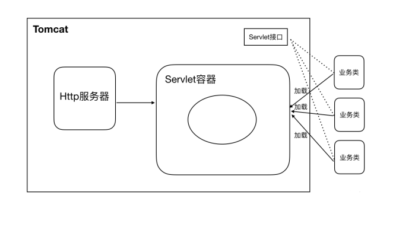
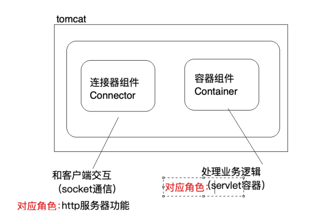
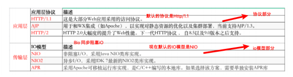
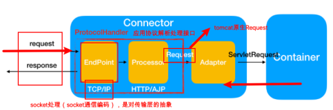
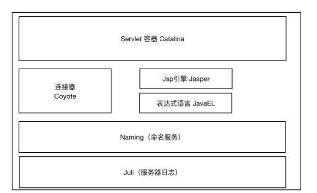
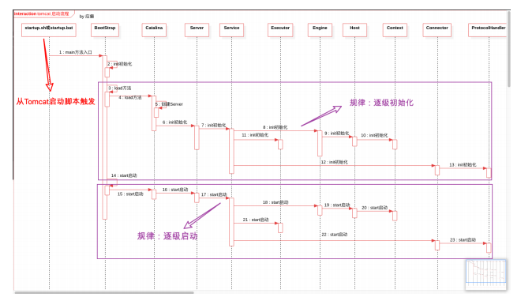
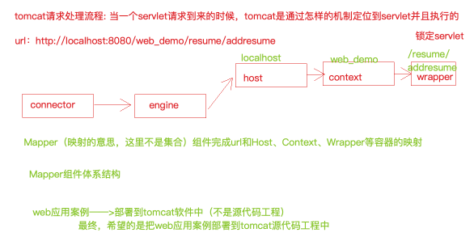
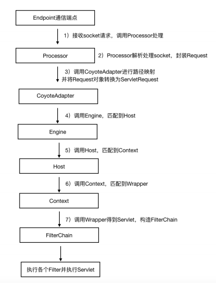
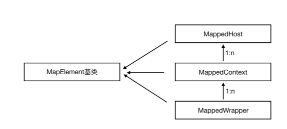
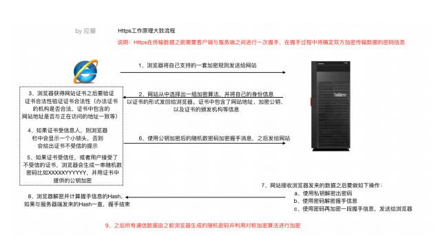

## Tomcat 介绍

### 系统架构

浏览器访问服务器使⽤的是Http协议，Http是应⽤层协议，⽤于定义数据通信的格式，具体的数
据传输使⽤的是TCP/IP协议

#### 架构设计

Tomcat的两个重要身份
1）http服务器
2）Tomcat是⼀个Servlet容器（实现了 Servlet 接口）

#### 主要组件

Coyote 是Tomcat 中连接器的组件名称 , 是对外的接⼝。客户端通过Coyote与服务器建⽴连接、发送请
求并接受响应 。
（1）Coyote 封装了底层的⽹络通信（Socket 请求及响应处理）
（2）Coyote 使Catalina 容器（容器组件）与具体的请求协议及IO操作⽅式完全解耦
（3）Coyote 将Socket 输⼊转换封装为 Request 对象，进⼀步封装后交由Catalina 容器进⾏处理，处
理请求完成后, Catalina 通过Coyote 提供的Response 对象将结果写⼊输出流
（4）Coyote 负责的是具体协议（应⽤层）和IO（传输层）相关内容

#### Coyote 组件及作⽤

#### Catalina 组件及作⽤

### Tomcat 配置

## Tomcat 原理

### Tomcat启动流程

### 请求处理流程分析

### 请求处理流程示意图

### Mapper组件体系结构

## JVM 的类加载机制

引导启动类加载器 BootstrapClassLoader
> c++编写，加载java核⼼库 java.*,⽐如rt.jar中的类，构造ExtClassLoader和AppClassLoader
扩展类加载器 ExtClassLoader
> java编写，加载扩展库 JAVA_HOME/lib/ext⽬录下的jar中的类，如classpath中的jre ，javax.*或者java.ext.dir指定位置中的类
系统类加载器 SystemClassLoader/AppClassLoader
> 默认的类加载器，搜索环境变量 classpath 中指明的路径

### 双亲委派机制的作⽤

防⽌重复加载同⼀个.class。通过委托去向上⾯问⼀问，加载过了，就不⽤再加载⼀遍。保证数据
安全。
保证核⼼.class不能被篡改。通过委托⽅式，不会去篡改核⼼.class，即使篡改也不会去加载，即使
加载也不会是同⼀个.class对象了。不同的加载器加载同⼀个.class也不是同⼀个.class对象。这样
保证了class执⾏安全（如果⼦类加载器先加载，那么我们可以写⼀些与java.lang包中基础类同名
的类， 然后再定义⼀个⼦类加载器，这样整个应⽤使⽤的基础类就都变成我们⾃⼰定义的类了。
）
Object类 -----> ⾃定义类加载器（会出现问题的，那么真正的Object类就可能被篡改了）

###  Tomcat 的类加载机制

引导类加载器 和 扩展类加载器 的作⽤不变
系统类加载器正常情况下加载的是 CLASSPATH 下的类，但是 Tomcat 的启动脚本并未使⽤该变量，⽽是加载tomcat启动的类，⽐如bootstrap.jar，通常在catalina.bat或者catalina.sh中指定。位于CATALINA_HOME/bin下
Common 通⽤类加载器加载Tomcat使⽤以及应⽤通⽤的⼀些类，位于CATALINA_HOME/lib下，⽐如servlet-api.jar
Catalina ClassLoader ⽤于加载服务器内部可⻅类，这些类应⽤程序不能访问
Shared ClassLoader ⽤于加载应⽤程序共享类，这些类服务器不会依赖
Webapp ClassLoader，每个应⽤程序都会有⼀个独⼀⽆⼆的Webapp ClassLoader，他⽤来加载本应⽤程序 /WEB-INF/classes 和 /WEB-INF/lib 下的类。

tomcat 8.5 默认改变了严格的双亲委派机制
⾸先从 Bootstrap Classloader加载指定的类
如果未加载到，则从 /WEB-INF/classes加载
如果未加载到，则从 /WEB-INF/lib/\*.jar 加载
如果未加载到，则依次从 System、Common、Shared 加载（在这最后⼀步，遵从双亲委派机制）

### HTTPS⼯作原理

`keytool -genkey -alias lagou -keyalg RSA -keystore lagou.keystore`

### Tomcat 性能优化策略

系统性能的衡量指标，主要是响应时间和吞吐量。
1）响应时间：执⾏某个操作的耗时；
2) 吞吐量：系统在给定时间内能够⽀持的事务数量，单位为TPS（Transactions PerSecond的缩写，也就是事务数/秒，⼀个事务是指⼀个客户机向服务器发送请求然后服务器做出反应的过程。
Tomcat优化从两个⽅⾯进⾏
1）JVM虚拟机优化（优化内存模型）
2）Tomcat⾃身配置的优化（⽐如是否使⽤了共享线程池？IO模型？）

> 参数调整示例

`JAVA_OPTS="-server -Xms2048m -Xmx2048m -XX:MetaspaceSize=256m -XX:MaxMetaspaceSize=512m"`

> 可使⽤JDK提供的内存映射⼯具

`jhsdb jmap --heap --pid 8481`

#### 垃圾收集器

 - 串⾏收集器（Serial Collector）
   - 单线程执⾏所有的垃圾回收⼯作， 适⽤于单核CPU服务器
   - ⼯作进程-----|（单线程）垃圾回收线程进⾏垃圾收集|---⼯作进程继续
 - 并⾏收集器（Parallel Collector）
   - ⼯作进程-----|（多线程）垃圾回收线程进⾏垃圾收集|---⼯作进程继续
   - ⼜称为吞吐量收集器（关注吞吐量）， 以并⾏的⽅式执⾏年轻代的垃圾回收， 该⽅式可以显著降低垃圾回收的开销(指多条垃圾收集线程并⾏⼯作，但此时⽤户线程仍然处于等待状态)。适⽤于多处理器或多线程硬件上运⾏的数据量较⼤的应⽤
 - 并发收集器（Concurrent Collector）
   - 以并发的⽅式执⾏⼤部分垃圾回收⼯作，以缩短垃圾回收的暂停时间。适⽤于那些响应时间优先于吞吐量的应⽤， 因为该收集器虽然最⼩化了暂停时间(指⽤户线程与垃圾收集线程同时执⾏,但不⼀定是并⾏的，可能会交替进⾏)， 但是会降低应⽤程序的性能
 - CMS收集器（Concurrent Mark Sweep Collector）
   - 并发标记清除收集器， 适⽤于那些更愿意缩短垃圾回收暂停时间并且负担的起与垃圾回收共享处理器资源的应⽤
 - G1收集器（Garbage-First Garbage Collector）
   - 适⽤于⼤容量内存的多核服务器， 可以在满⾜垃圾回收暂停时间⽬标的同时， 以最⼤可能性实现⾼吞吐量(JDK1.7之后)

### Tomcat 配置调优（自身相关）

 - 调整tomcat线程池
 - 调整tomcat的连接器
 - 禁⽤ A JP 连接器
 - 调整 IO 模式
   - 当Tomcat并发性能有较⾼要求或者出现瓶颈时，我们可以尝试使⽤APR模式，APR（Apache PortableRuntime）是从操作系统级别解决异步IO问题，使⽤时需要在操作系统上安装APR和Native（因为APR原理是使⽤使⽤JNI技术调⽤操作系统底层的IO接⼝）
 - 动静分离

## Nginx

Nginx 是⼀个⾼性能的HTTP和反向代理web服务器，核⼼特点是占有内存少，并发能⼒强

#### Nginx ⼜能做什么事情（应⽤场景）

 - Http服务器（Web服务器）
   - 性能⾮常⾼，⾮常注重效率，能够经受⾼负载的考验。⽀持50000个并发连接数，不仅如此，CPU和内存的占⽤也⾮常的低，10000个没有活动的连接才占⽤2.5M的内存。
 - 反向代理服务器
   - 正向代理
   - 反向代理
 - 负载均衡服务器
 - 动静分离

Nginx主要命令
 - ./nginx 启动nginx
 - ./nginx -s stop 终⽌nginx（当然也可以找到nginx进程号，然后使⽤kill -9 杀掉nginx进程）
 - ./nginx -s reload (重新加载nginx.conf配置⽂件)

目标服务器在处理请求的时候，nginx 在等待吗？？？

location 语法如下：
`location [=|~|~*|^~] /uri/ { … }`

Nginx负载均衡策略

 - 轮询
 - weight
 - ip_hash

 - master进程(主要是管理worker进程，⽐如：
   - 接收外界信号向各worker进程发送信号(./nginx -s reload)
   - 监控worker进程的运⾏状态，当worker进程异常退出后Master进程会⾃动重新启动新的worker进程等
 - worker进程
   - worker进程具体处理⽹络请求。多个worker进程之间是对等的，他们同等竞争来⾃客户端的请求，各进程互相之间是独⽴的。⼀个请求，只可能在⼀个worker进程中处理，⼀个worker进程，不可能处理其它进程的请求。worker进程的个数是可以设置的，⼀般设置与机器cpu核数⼀致。

nginx 的并发数要除以4???

以 ./nginx -s reload 来说明nginx信号处理这部分
1）master进程对配置⽂件进⾏语法检查
2）尝试配置（⽐如修改了监听端⼝，那就尝试分配新的监听端⼝）
3）尝试成功则使⽤新的配置，新建worker进程
4）新建成功，给旧的worker进程发送关闭消息
5）旧的worker进程收到信号会继续服务，直到把当前进程接收到的请求处理完毕后关闭
所以reload之后worker进程pid是发⽣了变化的

 - worker进程处理请求部分的说明
例如，我们监听9003端⼝，⼀个请求到来时，如果有多个worker进程，那么每个worker进程都有可能处理这个链接。
   - master进程创建之后，会建⽴好需要监听的的socket，然后从master进程再fork出多个worker进程。所以，所有worker进程的监听描述符listenfd在新连接到来时都变得可读。
   - nginx使⽤互斥锁来保证只有⼀个workder进程能够处理请求，拿到互斥锁的那个进程注册listenfd读事件，在读事件⾥调⽤accept接受该连接，然后解析、处理、返回客户端
 - nginx多进程模型好处
   - 每个worker进程都是独⽴的，不需要加锁，节省开销
   - 每个worker进程都是独⽴的，互不影响，⼀个异常结束，其他的照样能提供服务
   - 多进程模型为reload热部署机制提供了⽀撑

ngx_accept_mutex ？？？

10 万并发 ？？？

七层负载均衡

nginx 集群之上可以用四层负载均衡

限流：桶，令牌桶
