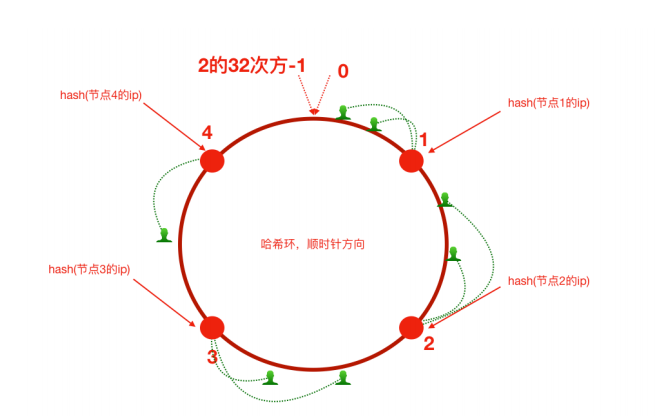
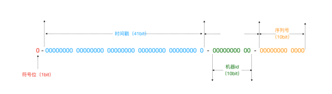
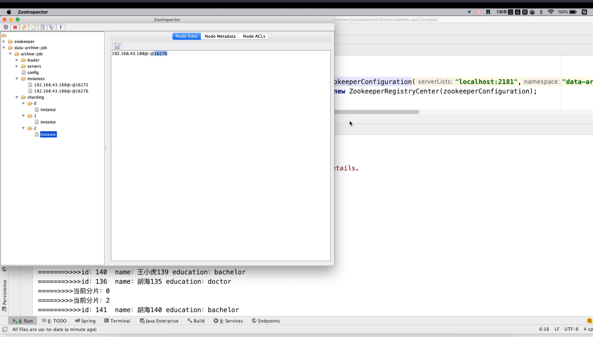

> 分布式⼀定是集群，但是集群不⼀定是分布式
> 分布式体现的是拆分，集群体现的是多份

## 一致性哈希

 - 顺序查找法 ：这种⽅式我们是通过循环来完成，⽐较原始，效率也不⾼
 - ⼆分查找：排序之后折半查找，相对于顺序查找法会提⾼⼀些效率，但是效率也并不是特别好
 - 直接寻址法：速度快，⼀次查找得到结果，但浪费空间，无法存储重复内容

如何解决：
对数据求模（hash 算法）这种构造Hash算法的⽅式叫做`除留余数法`
开放寻址法：1放进去了，6再来的时候，向前或者向后找空闲位置存放，不好的地⽅，如果数组⻓度定义好了⽐如10，⻓度不能扩展，来了11个数据，不管Hash冲突不冲突，肯定存不下这么多数据
拉链法：数据⻓度定义好了，怎么存储更多内容呢，算好Hash值，在数组元素存储位置放了⼀个链表


Hash表的查询效率⾼不⾼取决于Hash算法，尽量让数据平均分布。Hash表内部的Hash算法也⼀直在更新

java 的 hashcode???

### Hash算法应⽤场景

 - 请求的负载均衡（⽐如nginx的ip_hash策略:实现会话粘滞，避免处理session共享问题）
   - 如果用映射表维护，缺点：映射表⾮常⼤，浪费内存空间；客户端和⽬标服务器上下线，需要维护映射表
 - 分布式存储
   - hash(key1)%3=index

### 普通Hash算法存在的问题

扩容和缩容的时候，会重新生成映射关系，会话丢失，本地缓存浪费

### ⼀致性Hash算法（consistent_hash）



避免了⼤量请求迁移

⼀致性哈希算法在服务节点太少时，容易因为节点分部不均匀⽽造成数据倾斜（请求倾斜）问题

为了解决这种数据倾斜问题，⼀致性哈希算法引⼊了虚拟节点机制，即对每⼀个服务节点计算多个哈希，每个计算结果位置都放置⼀个此服务节点，称为虚拟节点。

ip 最后一位是0，特殊???

### nginx 添加 ngx_http_upstream_consistent_hash 模块

```./configure —add-module=/root/ngx_http_consistent_hash-master```

### 集群时钟不同步导致的问题

 - 方式一：从⼀个时间服务器同步时间
 > ntpdate -u ntp.api.bz

 - 方式二：只有部分能联网或者都不能联网（手动或联网设置一台，然后作为时间服务器）
```
# restrict default ignore，注释掉它
restrict 172.17.0.0 mask 255.255.255.0 nomodify notrap # 放开局
server 127.127.1.0 # local clock
fudge 127.127.1.0 stratum 10 # 时间和底层时钟保持同步
```

```
 service ntpd restart
 chkconfig ntpd on # 开机自启动
```

### 分布式ID解决⽅案

 - UUID （Universally Unique Identifier 即通⽤唯⼀识别码）
   - 特别长，没有规律
 - 独⽴数据库的⾃增ID
   - 性能和可靠性都不够好
 - SnowFlake 雪花算法（可以⽤，推荐）
 - 借助Redis的Incr命令获取全局唯⼀ID（推荐）



> ⼀切互联⽹公司也基于上述的⽅案封装了⼀些分布式ID⽣成器，⽐如滴滴的tinyid（基于数据库实现）、百度的uidgenerator（基于SnowFlake）和美团的leaf（基于数据库和SnowFlake）等

https://www.oschina.net/p/mt-leaf?hmsr=aladdin1e1

### 分布式调度问题

定时任务形式：每隔⼀定时间/特定某⼀时刻执⾏

什么是分布式任务调度

 - 运⾏在分布式集群环境下的调度任务（同⼀个定时任务程序部署多份，只应该有⼀个定时任务在执⾏）
 - 分布式调度—>定时任务的分布式—>定时任务的拆分（即为把⼀个⼤的作业任务拆分为多个⼩的作业任务，同时执⾏）

定时任务与消息队列的区别

 - 共同点
   - 异步处理（⽐如注册、下单事件）
   - 应⽤解耦
      - 不管定时任务作业还是MQ都可以作为两个应⽤之间的⻮轮实现应⽤解耦，这个⻮轮可以中转数据，当然单体服务不需要考虑这些，服务拆分的时候往往都会考虑
   - 流量削峰
      - 双⼗⼀的时候，任务作业和MQ都可以⽤来扛流量，后端系统根据服务能⼒定时处理订单或者从MQ抓取订单抓取到⼀个订单到来事件的话触发处理，对于前端⽤户来说看到的结果是已经下单成功了，下单是不受任何影响的
 - 本质不同
   - 定时任务作业是时间驱动，⽽MQ是事件驱动
   - 时间驱动是不可代替的，⽐如⾦融系统每⽇的利息结算，不是说利息来⼀条（利息到来事件）就算⼀下，⽽往往是通过定时任务批量计算
   - 所以，定时任务作业更倾向于批处理，MQ倾向于逐条处理

任务调度框架Quartz回顾示意

```java
// 定时任务作业主调度程序
public static void main(String[] args) throws SchedulerException {
 // 创建⼀个作业任务调度器（类似于公交调度站）
 Scheduler scheduler = QuartzMain.createScheduler();
 // 创建⼀个作业任务（类似于⼀辆公交⻋）
 JobDetail job = QuartzMain.createJob();
 // 创建⼀个作业任务时间触发器（类似于公交⻋出⻋时间表）
 Trigger trigger = QuartzMain.createTrigger();
 // 使⽤调度器按照时间触发器执⾏这个作业任务
 scheduler.scheduleJob(job,trigger);
 scheduler.start();
}
```


Elastic-Job 主要功能介绍

 - 分布式调度协调，在分布式环境中，任务能够按指定的调度策略执⾏，并且能够避免同⼀任务多实例重复执
 - 丰富的调度策略 基于成熟的定时任务作业框架Quartz cron表达式执⾏定时任务
 - 弹性扩容缩容 当集群中增加某⼀个实例，它应当也能够被选举并执⾏任务；当集群减少⼀个实例时，它所执⾏的任务能被转移到别的实例来执⾏。
 - 失效转移 某实例在任务执⾏失败后，会被转移到其他实例执⾏
 - 错过执⾏作业重触发 若因某种原因导致作业错过执⾏，⾃动记录错过执⾏的作业，并在上次作业完成后⾃动触发。
 - ⽀持并⾏调度 ⽀持任务分⽚，任务分⽚是指将⼀个任务分为多个⼩任务项在多个实例同时执⾏。
 - 作业分⽚⼀致性 当任务被分⽚后，保证同⼀分⽚在分布式环境中仅⼀个执⾏实例。

去中心化

 - 执行节点对等（程序和jar一样）（分片时不一样）
 - 定时任务自触发（没有中心调度节点分配）
 - 服务自发现
 - 主节点非固定（并不是分发任务的中心）

轻量级
 - All in jar，只要依赖 zookeeper
 - 并非独立部署的中间件，只有 jar 包

任务分⽚



弹性扩容

 - 分⽚项也是⼀个JOB配置，修改配置，重新分⽚，在下⼀次定时运⾏之前会重新调⽤分⽚算法，那么这个分⽚算法的结果就是：哪台机器运⾏哪⼀个⼀⽚，这个结果存储到zk中的，主节点会把分⽚给分好放到注册中⼼去，然后执⾏节点从注册中⼼获取信息(执⾏节点在定时任务开启的时候获取相应的分⽚。
 - 如果所有的节点挂掉值剩下⼀个节点，所有分⽚都会指向剩下的⼀个节点，这也是ElasticJob的⾼可⽤。

高可用

### Session共享问题

重定向请求的原理???

解决Session⼀致性的⽅案

 - Nginx的 IP_Hash 策略（会话粘滞）（可以使⽤）
   - 优点：配置简单，不⼊侵应⽤，不需要额外修改代码
   - 缺点：服务器重启Session丢失; 存在单点负载⾼的⻛险; 单点故障问题
 - Session复制（不推荐）
   - 多个tomcat之间通过修改配置⽂件，达到Session之间的复制（组播 TCP）
 - Session共享，Session集中存储（推荐）
   - 优点:能适应各种负载均衡策略;服务器重启或者宕机不会造成Session丢失;扩展能⼒强;适合⼤集群数量使⽤
   - 缺点：对应⽤有⼊侵，引⼊了和Redis的交互代码


