### Socket 网络编程

Socket，套接字就是两台主机之间逻辑连接的端点。TCP/IP协议是传输层协议，主要解决数据如何
在网络中传输，而HTTP是应用层协议，主要解决如何包装数据。Socket是通信的基石，是支持TCP/IP协
议的网络通信的基本操作单元。它是网络通信过程中端点的抽象表示，包含进行网络通信必须的五种信
息：连接使用的协议、本地主机的IP地址、本地进程的协议端口、远程主机的IP地址、远程进程的协议
端口。

### I/O模型说明

 -  BIO(同步并阻塞)
   1. 每个请求都需要创建独立的线程，与对应的客户端进行数据 Read，业务处理，数据 Write
   2. 并发数较大时，需要创建大量线程来处理连接，系统资源占用较大
   3. 连接建立后，如果当前线程暂时没有数据可读，则线程就阻塞在 Read 操作上，造成线程资源浪费
 -  NIO(同步非阻塞)
   - 同步非阻塞，服务器实现模式为一个线程处理多个请求(连接)，即客户端发送的连接请求都会注册到多路复用器上，多路复用器轮询到连接有 I/O 请求就进行处理
 -  AIO(异步非阻塞)
   - AIO 引入异步通道的概念，采用了 Proactor 模式，简化了程序编写，有效的请求才启动线程，它的特点是先由操作系统完成后才通知服务端程序启动线程去处理，一般适用于连接数较多且连接时间较长的应用

#### BIO、NIO、AIO 适用场景分析

1. BIO(同步并阻塞) 方式适用于连接数目比较小且固定的架构，这种方式对服务器资源要求比较高，
并发局限于应用中，JDK1.4以前的唯一选择，但程序简单易理解
2. NIO(同步非阻塞) 方式适用于连接数目多且连接比较短（轻操作）的架构，比如聊天服务器，弹幕
系统，服务器间通讯等。编程比较复杂，JDK1.4 开始支持
3. AIO(异步非阻塞) 方式使用于连接数目多且连接比较长（重操作）的架构，比如相册服务器，充分
调用 OS 参与并发操作， 编程比较复杂，JDK7 开始支持。

#### NIO和 BIO的比较

1. BIO 以流的方式处理数据,而 NIO 以缓冲区的方式处理数据,缓冲区 I/O 的效率比流 I/O 高很多
2. BIO 是阻塞的，NIO则是非阻塞的
3. BIO 基于字节流和字符流进行操作，而 NIO 基于 Channel(通道)和 Buffer(缓冲区)进行操作，数据总是从通道读取到缓冲区中，或者从缓冲区写入到通道中。Selector(选择器)用于监听多个通道的事件（比如：连接请求， 数据到达等），因此使用单个线程就可以监听多个客户端通道

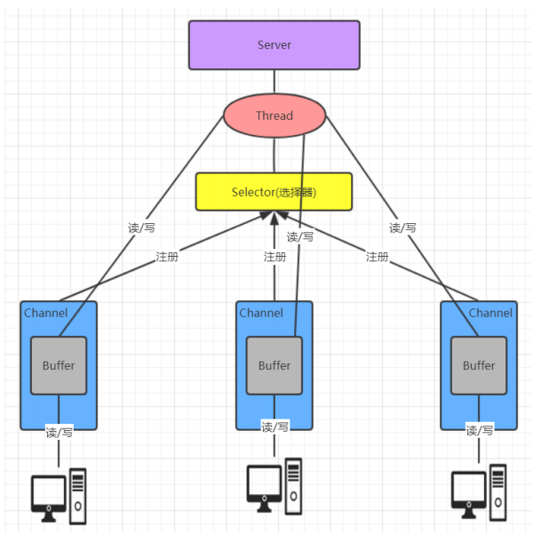

#### 缓冲区对象添加数据

 - position: 获得当前要操作的索引
 - limit: 最多能操作到哪个索引
 - capacity: 返回缓冲区的总长度
 - remaining: 还有多少能操作索引个数

> 如果缓存区存满后, 可以调整position位置可以重复写,这样会覆盖之前存入索引的对应的值

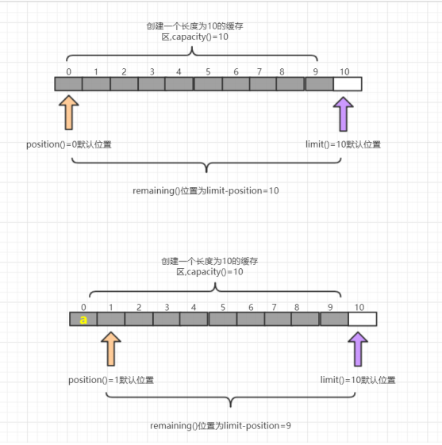

#### 缓冲区对象读取数据

 - flip(): 写切换读模式 limit设置position位置, position设置0
 - get(): 读一个字节
 - rewind(): 将position设置为0，可以重复读
 - clear(): 切换写模式 position设置为0 , limit 设置为 capacity
 - array(): 将缓冲区转换成字节数组返回（没写入的也会返回）

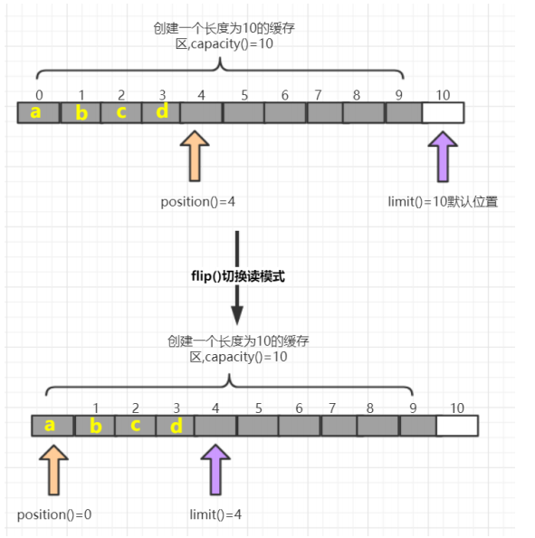

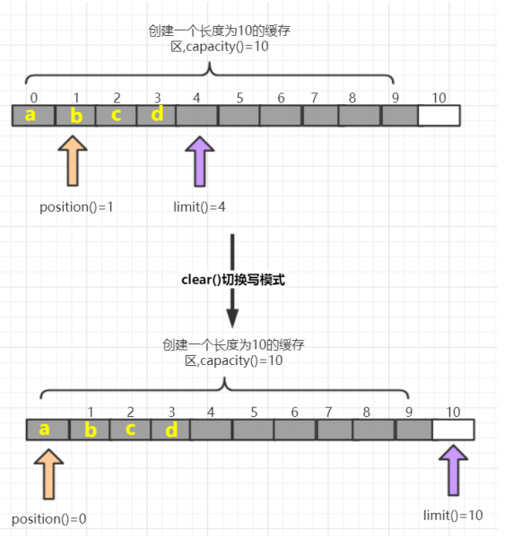

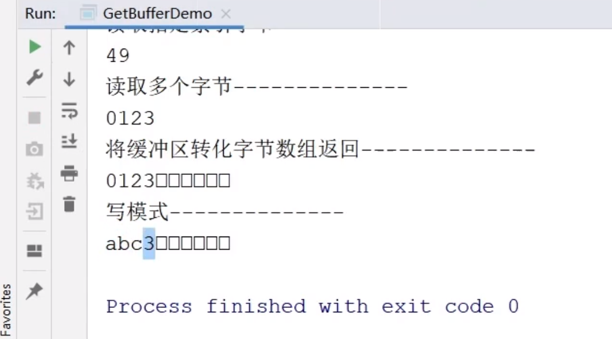

#### 通道(Channel)基本介绍

1. 通道可以读也可以写，流一般来说是单向的（只能读或者写，所以之前我们用流进行IO操作的时候需要分别创建一个输入流和一个输出流）
2. 通道可以异步读写
3. 通道总是基于缓冲区Buffer来读写

```java
package com.lagou.channel;
import java.io.IOException;
import java.net.InetSocketAddress;
import java.nio.ByteBuffer;
import java.nio.channels.SocketChannel;
import java.nio.charset.StandardCharsets;
/**
* 客户端
*/
public class NIOClient {
  public static void main(String[] args) throws IOException {
    //1.打开通道
    SocketChannel socketChannel = SocketChannel.open();
    //2.设置连接IP和端口号
    socketChannel.connect(new InetSocketAddress("127.0.0.1", 9999));
    //3.写出数据
    socketChannel.write(ByteBuffer.wrap("老板, 该还钱拉!".getBytes(StandardCharsets.UTF_8)));
    //4.读取服务器写回的数据
    ByteBuffer readBuffer = ByteBuffer.allocate(1024);
    int read=socketChannel.read(readBuffer);  // 这里要等待 write 完
    System.out.println("服务端消息:" + new String(readBuffer.array(), 0, read,
    StandardCharsets.UTF_8));
    //5.释放资源
    socketChannel.close();
  }
}
```

#### Selector (选择器)基本介绍

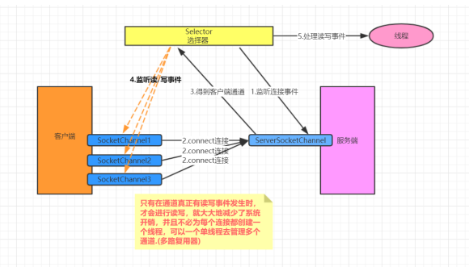

##### 常用方法
 - SelectionKey.isAcceptable(): 是否是连接继续事件
 - SelectionKey.isConnectable(): 是否是连接就绪事件
 - SelectionKey.isReadable(): 是否是读就绪事件
 - SelectionKey.isWritable(): 是否是写就绪事件
##### SelectionKey中定义的4种事件:
 - SelectionKey.OP_ACCEPT —— 接收连接继续事件，表示服务器监听到了客户连接，服务器可以接收这个连接了
 - SelectionKey.OP_CONNECT —— 连接就绪事件，表示客户端与服务器的连接已经建立成功
 - SelectionKey.OP_READ —— 读就绪事件，表示通道中已经有了可读的数据，可以执行读操作了（通道目前有数据，可以进行读操作了）
 - SelectionKey.OP_WRITE —— 写就绪事件，表示已经可以向通道写数据了（通道目前可以用于写操作）

### Netty 介绍

#### 原生 NIO 存在的问题 ???

1. NIO 的类库和 API 繁杂，使用麻烦：需要熟练掌握 Selector、ServerSocketChannel、SocketChannel、ByteBuffer等。
2. 需要具备其他的额外技能：要熟悉 Java 多线程编程，因为 NIO 编程涉及到 Reactor 模式，你必须对多线程和网络编程非常熟悉，才能编写出高质量的 NIO 程序。
3. 开发工作量和难度都非常大：例如客户端面临断连重连、网络闪断、半包读写、失败缓存、网络拥塞和异常流的处理等等。
4. JDK NIO 的 Bug：臭名昭著的 Epoll Bug，它会导致 Selector 空轮询，最终导致 CPU 100%。直到JDK 1.7版本该问题仍旧存在，没有被根本解决

> 在NIO中通过Selector的轮询当前是否有IO事件，根据JDK NIO api描述，Selector的select方法会一直阻塞，直到IO事件达到或超时，但是在Linux平台上这里有时会出现问题，在某些场景下select方法会直接返回，即使没有超时并且也没有IO事件到达，这就是著名的epollbug，这是一个比较严重的bug，它会导致线程陷入死循环，会让CPU飙到100%，极大地影响系统的可靠性，到目前为止，JDK都没有完全解决这个问题。

> 知名的 Elasticsearch 、Dubbo 框架内部都采用了 Netty

> Netty 的强大之处：零拷贝、可拓展事件模型；支持 TCP、UDP、HTTP、WebSocket 等协议；提供安全传输、压缩、大文件传输、编解码支持等等

Netty 具备如下优点:

1. 设计优雅，提供阻塞和非阻塞的 Socket；提供灵活可拓展的事件模型；提供高度可定制的线程模型。
2. 具备更高的性能和更大的吞吐量，使用零拷贝技术最小化不必要的内存复制，减少资源的消耗。
3. 提供安全传输特性。
4. 支持多种主流协议；预置多种编解码功能，支持用户开发私有协议。

#### 线程模型基本介绍

 - 传统阻塞 I/O 服务模型
 - Reactor 模型
   - 单 Reactor 单线程
   - 单 Reactor 多线程
   - 主从 Reactor 多线程

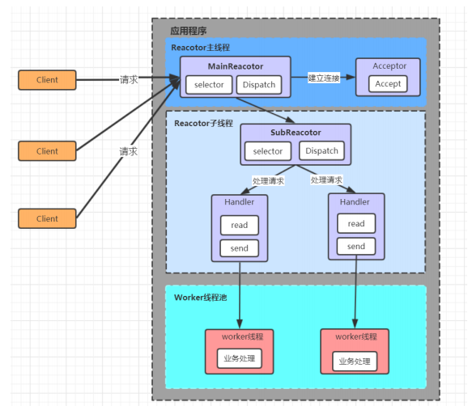

这种模式的缺点是编程复杂度较高。但是由于其优点明显，在许多项目中被广泛使用，包括Nginx、Memcached、Netty 等。这种模式也被叫做服务器的 1+M+N 线程模式，即使用该模式开发的服务器包含一个（或多个，1 只是表示相对较少）连接建立线程+M 个 IO 线程+N 个业务处理线程。这是业界成熟的服务器程序设计模式。

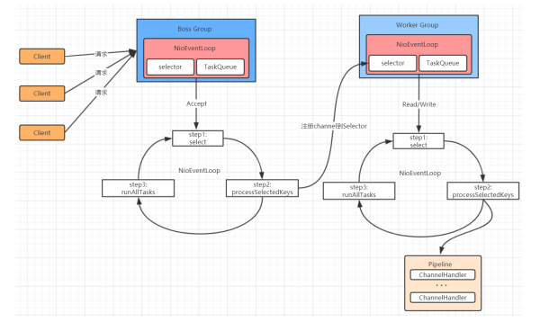

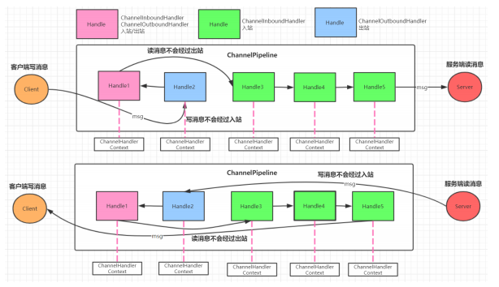

如果客户端和服务器的Handler是一样的，消息从客户端到服务端或者反过来，每个Inbound类型或Outbound类型的Handler只会经过一次，混合类型的Handler（实现了Inbound和Outbound的Handler）会经过两次。准确的说ChannelPipeline中是一个ChannelHandlerContext,每个上下文对象中有ChannelHandler. InboundHandler是按照Pipleline的加载顺序的顺序执行, OutboundHandler是按照Pipeline的加载顺序，逆序执行

ChannelFuture sync()，等待异步操作执行完毕,将异步改为同步 ???

TCP 属于传输层为什么有端口???

go 异步变同步，channel???
#### Netty 编解码器

#### 粘包和拆包的解决方法

业内解决方案

> 由于底层的TCP无法理解上层的业务数据，所以在底层是无法保证数据包不被拆分和重组的，这个问题只能通过上层的应用协议栈设计来解决，根据业界的主流协议的解决方案，可以归纳如下。

 - 消息长度固定，累计读取到长度和为定长LEN的报文后，就认为读取到了一个完整的信息
 - 将换行符作为消息结束符
 - 将特殊的分隔符作为消息的结束标志，回车换行符就是一种特殊的结束分隔符
 - 通过在消息头中定义长度字段来标识消息的总长度

Netty中的粘包和拆包解决方案

 - 固定长度的拆包器 FixedLengthFrameDecoder，每个应用层数据包的都拆分成都是固定长度的大小
 - 行拆包器 LineBasedFrameDecoder，每个应用层数据包，都以换行符作为分隔符，进行分割拆分
 - 分隔符拆包器 DelimiterBasedFrameDecoder，每个应用层数据包，都通过自定义的分隔符，进行分割拆分
 - 基于数据包长度的拆包器 LengthFieldBasedFrameDecoder，将应用层数据包的长度，作为接收端应用层数据包的拆分依据。按照应用层数据包的大小，拆包。这个拆包器，有一个要求，就是应用层协议中包含数据包的长度

TCP 是长连接，为什么基于 TCP 的 HTTP 是短连接???

#### RPC架构四个核心的组件

 - 客户端(Client)，服务的调用方。
 - 客户端存根(Client Stub)，存放服务端的地址消息，再将客户端的请求参数打包成网络消息，然后通过网络远程发送给服务方。
 - 服务端(Server)，真正的服务提供者。
 - 服务端存根(Server Stub)，接收客户端发送过来的消息，将消息解包，并调用本地的方法。

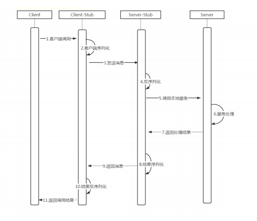

服务端将通道设置为共享的???
客户端将线程等待设置为线程安全的???

#### 分布式与集群的区别

集群: 多个服务器做同一个事情
分布式: 多个服务器做不同的事情

#### 分布式系统特性

1. 分布性
空间中随机分布。这些计算机可以分布在不同的机房，不同的城市，甚至不同的国家。
2. 对等性
分布式系统中的计算机没有主/从之分，组成分布式系统的所有节点都是对等的。
3. 并发性
同一个分布式系统的多个节点，可能会并发地操作一些共享的资源，诸如数据库或分布式存储。
4. 缺乏全局时钟
既然各个计算机之间是依赖于交换信息来进行相互通信，很难定义两件事件的先后顺序，缺乏全局始终控制序列
5. 故障总会发生
组成分布式的计算机，都有可能在某一时刻突然间崩掉。分的计算机越多，可能崩掉一个的几率就越大。如果再考虑到设计程序时的异常故障，也会加大故障的概率。
6. 处理单点故障
单点SPoF（Single Point of Failure）：某个角色或者功能只有某一台计算机在支撑，在这台计算机上出现的故障是单点故障。

#### 分布式系统面临的问题

1. 通信异常
2. 网络分区
3. 节点故障
4. 三态
5. 重发
6. 幂等

### 数据一致性

#### 分布式数据一致性

分布式数据一致性，指的是数据在多份副本中存储时，各副本中的数据是一致的。

#### 副本一致性

分布式系统当中，数据往往会有多个副本。多个副本就需要保证数据的一致性。这就带来了同步的问题，因为网络延迟等因素, 我们几乎没有办法保证可以同时更新所有机器当中的包括备份所有数据. 就会有数据不一致的情况

#### 一致性分类

1. 强一致性
2. 弱一致性
3. 最终一致性（最终一致性也是弱一致性的一种）

#### 最终一致性在实际应用中又有多种变种：

1. 因果一致性
2. 读己之所写一致性（是因果一致性模型的一个特例）
3. 会话一致性
4. 单调读一致性
5. 单调写一致性

#### 一致性模型图

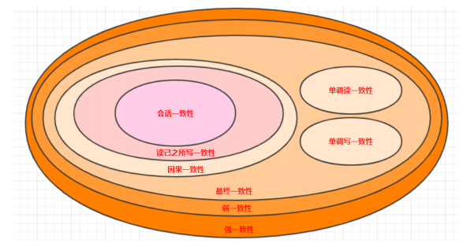

### CAP定理

1. 一致性（C-Consistency)
2. 可用性（A-Availability)
3. 分区容错性（P-Partition tolerance）

CA (Consistency + Availability)：关注一致性和可用性，它需要非常严格的全体一致的协议。
CP (consistency + partition tolerance)：关注一致性和分区容忍性。它关注的是系统里大多数人的一致性协议。
AP (availability + partition tolerance)：这样的系统关心可用性和分区容忍性。

#### 如何进行三选二

放弃了一致性，满足分区容错，那么节点之间就有可能失去联系，为了高可用，每个节点只能用本地数据提供服务，而这样会容易导致全局数据不一致性。对于互联网应用来说，机器数量庞大，节点分散，网络故障再正常不过了，那么此时就是保障AP，放弃C的场景，而从实际中理解，像网站这种偶尔没有一致性是能接受的，但不能访问问题就非常大了。

对于银行来说，就是必须保证强一致性，也就是说C必须存在，那么就只用CA和CP两种情况，当保障强一致性和可用性（CA），那么一旦出现通信故障，系统将完全不可用。另一方面，如果保障了强一致性和分区容错（CP），那么就具备了部分可用性。实际究竟应该选择什么，是需要通过业务场景进行权衡的（并不是所有情况都是CP好于CA，只能查看信息但不能更新信息有时候还不如直接拒绝服务）

#### BASE理论

上面我们讲到CAP 不可能同时满足，而分区容错性是对于分布式系统而言，是必须的。最后，我们说，如果系统能够同时实现 CAP 是再好不过的了，所以出现了 BASE 理论，

BASE：全称：Basically Available(基本可用)，Soft state（软状态）,和 Eventually consistent（最终一致性）三个短语的缩写 ,Base 理论是对 CAP 中一致性和可用性权衡的结果，其来源于对大型互联网分布式实践的总结，是基于 CAP 定理逐步演化而来的。其核心思想是： 既是无法做到强一致性（Strongconsistency），但每个应用都可以根据自身的业务特点，采用适当的方式来使系统达到最终一致性（Eventualconsistency）。

1. Basically Available(基本可用)
 - 响应时间上的损失：正常情况下的搜索引擎 0.5 秒即返回给用户结果，而基本可用的搜索引擎可以在 1 秒返回结果。
 - 功能上的损失：在一个电商网站上，正常情况下，用户可以顺利完成每一笔订单，但是到了大促期间，为了保护购物系统的稳定性，部分消费者可能会被引导到一个降级页面
2. Soft state（软状态）
 - 允许系统中的数据存在中间状态，并认为该状态不会影响系统的整体可用性，即允许系统在多个不同节点的数据副本存在数据延时。
3. Eventually consistent（最终一致性）

### 分布式一致性协议

#### 两阶段提交协议(2PC)

> 是比较常用的解决分布式事务问题的方式，要么所有参与进程都提交事务，要么都取消事务，即实现ACID中的原子性(A)的常用手段。

#### 三阶段提交协议(3PC)

3PC，全称 “three phase commit”，是 2PC 的改进版，将 2PC 的 “提交事务请求” 过程一分为二，共形成了由CanCommit、PreCommit和doCommit三个阶段组成的事务处理协议。

`3PC协议并没有完全解决数据一致问题。` PreCommit 后，协调者调用回滚，参与者如果没收到会自动 commit

#### NWR协议

NWR是一种在分布式存储系统中用于控制一致性级别的一种策略。在亚马逊的云存储系统中，就应用NWR来控制一致性。

 - N：在分布式存储系统中，有多少份备份数据
 - W：代表一次成功的更新操作要求至少有w份数据写入成功
 - R： 代表一次成功的读数据操作要求至少有R份数据成功读取

NWR值的不同组合会产生不同的一致性效果，当W+R>N的时候，整个系统对于客户端来讲能保证强一致性。

#### Gossip 协议

Gossip 协议也叫 Epidemic 协议 （流行病协议）。原本用于分布式数据库中节点同步数据使用，后被广泛用于数据库复制、信息扩散、集群成员身份确认、故障探测等。

1. 反熵传播
2. 谣言传播

根据不同的具体应用场景，网络中两个节点之间存在三种通信方式：推送模式、拉取模式、推/拉模式

Gossip 协议由于以上的优缺点，所以适合于 AP 场景的数据一致性处理，常见应用有：P2P 网络通信、Redis Cluster、Consul。

#### Paxos协议

Paxos协议其实说的就是Paxos算法, Paxos算法是基于消息传递且具有高度容错特性的一致性算法，是目前公认的解决分布式一致性问题最有效的算法之一。

Paxos 解决了什么问题

在常见的分布式系统中，总会发生诸如机器宕机或网络异常（包括消息的延迟、丢失、重复、乱序，还有网络分区）等情况。Paxos算法需要解决的问题就是如何在一个可能发生上述异常的分布式系统中，快速且正确地在集群内部对某个数据的值达成一致，并且保证不论发生以上任何异常，都不会破坏整个系统的一致性。

其实对 3PC 引入多个协调者之后又引入主协调者.那么这个就是最简单的一种Paxos 算法.

Paxos的版本有: Basic Paxos , Multi Paxos, Fast-Paxos, 具体落地有Raft 和zk的ZAB协议

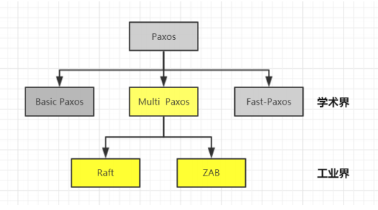

#### Raft协议

斯坦福大学RamCloud项目中提出了易实现，易理解的分布式一致性复制协议 Raft。Java，C++，Go 等都有其对应的实现之后出现的Raft相对要简洁很多。引入主节点，通过竞选确定主节点。节点类型：Follower、Candidate 和 Leader

Leader 会周期性的发送心跳包给 Follower。每个 Follower 都设置了一个随机的竞选超时时间，一般为 150ms-300ms，如果在这个时间内没有收到 Leader 的心跳包，就会变成 Candidate，进入竞选阶段, 通过竞选阶段的投票多的人成为Leader

少数派的 term 会不会比较高???

#### Lease机制

Lease机制，翻译过来即是租约机制，是一种在分布式系统常用的协议，是维护分布式系统数据一致性的一种常用工具。

lease时间长短一般取经验值1-10秒即可。太短网络压力大，太长则收回承诺时间过长影响可用性

### 分布式系统设计策略

#### 心跳检测

#### 高可用(High Availability)

高可用HA下"脑裂问题"

#### 容错性

1. 临时存放null值
2. 使用布隆过滤器

#### 负载均衡

负载均衡器有硬件解决方案，也有软件解决方案。硬件解决方案有著名的F5，软件有LVS、HAProxy、Nginx等。

####  分布式架构服务调用

HTTP 应用协议的通信框架

RPC 框架

跨域调用

#### 分布式服务治理

分布式锁也就是我们分布式协调技术实现的核心内容。

服务削峰

服务降级

服务限流

服务熔断

服务链路追踪

#### 架构设计基本原则

开闭原则

单一职责原则

接口隔离原则

里氏替换原则

依赖倒置原则

迪米特法则

合成复用原则


