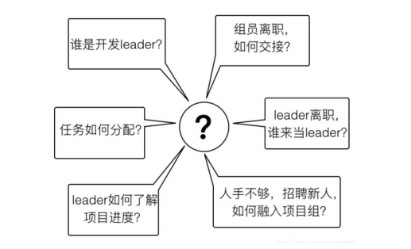

### 分布式系统定义及⾯临的问题

分布式系统的协调⼯作就是通过某种⽅式，让每个节点的信息能够同步和共享。这依赖于服务进程之间的通信。通信⽅式有两种：

 - 通过⽹络进⾏信息共享
 - 通过共享存储(SVN)

> ⼤多数分布式系统中出现的问题，都源于信息的共享出了问题。

### zookeeper的基本概念

Zookeeper是⼀个开源的分布式协调服务，其设计⽬标是将那些复杂的且容易出错的分布式⼀致性服务封装起来，构成⼀个⾼效可靠的原语集，并以⼀些简单的接⼝提供给⽤户使⽤。zookeeper是⼀个典型的分布式数据⼀致性的解决⽅案，分布式应⽤程序可以基于它实现诸如数据订阅/发布、负载均衡、命名服务、集群管理、分布式锁和分布式队列等功能

 - ① 集群⻆⾊
   - Zookeeper颠覆了传统的Master/Slave概念，⽽是引⼊了Leader、Follower、Observer三种⻆⾊。
 - ② 会话（session）
   - ⼀个客户端连接是指客户端和服务端之间的⼀个TCP⻓连接
 - ③ 数据节点（Znode）（不同于机器节点）
 - ④ 版本
 - ⑤ Watcher（事件监听器）
 - ⑥ ACL

#### Zookeeper的搭建⽅式

> Zookeeper安装⽅式有三种，单机模式和集群模式以及伪集群模式

伪集群模式：
 - clientPort端⼝
 - dataDir和dataLogDir
 - server.X和myid

### ZooKeeper系统模型

#### ZNode 的类型

 - 持久性节点（Persistent）
 - 临时性节点（Ephemeral）
 - 顺序性节点（Sequential）

 - 持久节点
 - 持久顺序节点
 - 临时节点 (会话结束，节点会被删除、不能创建子节点)
 - 临时顺序节点

#### 事务ID

> 在ZooKeeper中，事务是指能够改变ZooKeeper服务器状态的操作，我们也称之为事务操作或更新操作，⼀般包括数据节点创建与删除、数据节点内容更新等操作。对于每⼀个事务请求，ZooKeeper都会为其分配⼀个全局唯⼀的事务ID，⽤ ZXID 来表示，通常是⼀个 64 位的数字。每⼀个 ZXID 对应⼀次更新操作，从这些ZXID中可以间接地识别出ZooKeeper处理这些更新操作请求的全局顺序

#### Watcher--数据变更通知

#### ACL--保障数据的安全

> 们可以从三个⽅⾯来理解ACL机制：权限模式（Scheme）、授权对象（ID）、权限（Permission），通常使⽤"scheme: id : permission"来标识⼀个有效的ACL信息。

权限模式⽤来确定权限验证过程中使⽤的检验策略，有如下四种模式：
1. IP
2. Digest
3. World
4. Super

#### ZooKeeper命令⾏操作

通知是一次性的，万一丢了怎么办

zkClient 可以对一个不存在的节点进行子节点变更的监听

curator是Netflix公司开源的⼀套Zookeeper客户端框架，和ZKClient⼀样，Curator解决了很多Zookeeper客户端⾮常底层的细节开发⼯作，包括连接重连，反复注册Watcher和NodeExistsException异常等，是最流⾏的Zookeeper客户端之⼀。从编码⻛格上来讲，它提供了基于Fluent的编程⻛格⽀持

### Zookeeper应⽤场景

#### 数据发布/订阅

 - 配置中心
 - ZooKeeper 采⽤的是推拉相结合的⽅式

#### 命名服务

 - 顺序节点

#### 集群管理

 - 集群监控
 - 集群控制

Zookeeper的两⼤特性：

 1. 客户端如果对Zookeeper的数据节点注册Watcher监听，那么当该数据节点的内容或是其⼦节点列表发⽣变更时，Zookeeper服务器就会向订阅的客户端发送变更通知。
 2. 对在Zookeeper上创建的临时节点，⼀旦客户端与服务器之间的会话失效，那么临时节点也会被⾃动删除

分布式⽇志收集系统

 - ① 注册收集器机器
 - ② 任务分发
 - ③ 状态汇报
 - ④ 动态分配（ 全局动态分配|局部动态分配）

#### Master选举

 - 同名节点唯一性
 - wartch 机制重选

#### 分布式锁

 - 排他锁（X锁）
 - 共享锁（S锁） 获取W锁时前面有多个R锁时，只监听最后一个够吗???
 - ⽺群效应

#### 分布式队列

 - FIFO：先⼊先出
 - Barrier：分布式屏障

#### ZAB协议（Zookeeper Atomic Broadcast 原⼦消息⼴播协议）

ZAB核⼼: ZAB协议的核⼼是定义了对于那些会改变Zookeeper服务器数据状态的事务请求的处理⽅式

ZAB协议包括两种基本的模式：崩溃恢复和消息⼴播

 - ① 消息⼴播
 - ② 崩溃恢复

#### 运⾏时状态分析

 - LOOKING
 - FOLLOWING
 - LEADING

#### ZAB与Paxos的联系和区别

 - 联系：
   - ① 都存在⼀个类似于Leader进程的⻆⾊，由其负责协调多个Follower进程的运⾏。
   - ② Leader进程都会等待超过半数的Follower做出正确的反馈后，才会将⼀个提议进⾏提交。
   - ③ 在ZAB协议中，每个Proposal中都包含了⼀个epoch值，⽤来代表当前的Leader周期，在Paxos算法中，同样存在这样的⼀个标识，名字为Ballot。
 - 区别：
   - 两者的设计⽬标不太⼀样，ZAB协议主要⽤于构建⼀个⾼可⽤的分布式数据主备系统，⽽Paxos算法则⽤于构建⼀个分布式的⼀致性状态机系统

### 服务器⻆⾊

#### Leader

1. PrepRequestProcessor。请求预处理器
2. ProposalRequestProcessor。事务投票处理器
3. SyncRequestProcessor。事务⽇志记录处理器
4. AckRequestProcessor。负责在SyncRequestProcessor完成事务⽇志记录后，向Proposal的投票收集器发送ACK反馈
5. CommitProcessor。事务提交处理器
6. ToBeCommitProcessor。该处理器有⼀个toBeApplied队列，⽤来存储那些已经被CommitProcessor处理过的可被提交的Proposal。
7. FinalRequestProcessor。⽤来进⾏客户端请求返回之前的操作，包括创建客户端请求的响应，针对事务请求，该处理器还会负责将事务应⽤到内存数据库中。

#### Follower

1. FollowerRequestProcessor 其⽤作识别当前请求是否是事务请求
2. SendAckRequestProcessor 其承担了事务⽇志记录反馈的⻆⾊

#### Observer

### 服务器启动

1. 配置⽂件解析
2. 初始化数据管理器
3. 初始化⽹络I/O管理器
4. 数据恢复
5. 对外服务

可以分为预启动、初始化、Leader选举、Leader与Follower启动期交互、Leader与Follower启动等过程

