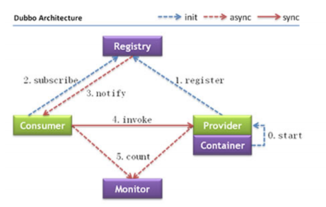

### 项目架构演变过程

可以同级调用吗???

Dubbo 三大核心能力

 - 面向接口远程方法调用
 - 只能容错、负载均衡
 - 服务自动注册与发现

### Dubbo架构与实战

#### Dubbo 的服务治理

> 服务治理（SOA governance），企业为了确保项目顺利完成而实施的过程，包括最佳实践、架构原则、治理规程、规律以及其他决定性的因素。服务治理指的是用来管理SOA的采用和实现的过程。

参考 https://dubbo.apache.org/zh/docs/v2.7/user/preface/requirements/



软负载均衡和硬负载均衡???

#### Dubbo开发实战

> 建议将服务接口、服务模型、服务异常等均放在 API 包中，因为服务模型和异常也是 API 的一部分，这样做也符合分包原则：重用发布等价原则(REP)，共同重用原则(CRP)。???

下面我们来使用不同的方式来对Dubbo进行配置。每种配置方式各有不同，一般可以分为以下几个。
1. 注解: 基于注解可以快速的将程序配置，无需多余的配置信息，包含提供者和消费者。但是这种方式有一个弊端，有些时候配置信息并不是特别好找，无法快速定位。
2. XML: 一般这种方式我们会和Spring做结合，相关的Service和Reference均使用Spring集成后的。通过这样的方式可以很方便的通过几个文件进行管理整个集群配置。可以快速定位也可以快速更改。
3. 基于代码方式: 基于代码方式的对上述配置进行配置。这个使用的比较少，这种方式更适用于自己公司对其框架与Dubbo做深度集成时才会使用。

### Dubbo管理控制台 dubbo-admin

> 主要包含：服务管理 、 路由规则、动态配置、服务降级、访问控制、权重调整、负载均衡等管理功能

### Dubbo配置项说明

### SPI

SPI 全称为 (Service Provider Interface) ，是JDK内置的一种服务提供发现机制。 目前有不少框架用它来做服务的扩展发现，简单来说，它就是一种动态替换发现的机制。使用SPI机制的优势是实现解耦，使得第三方服务模块的装配控制逻辑与调用者的业务代码分离。

SPI遵循如下约定：

1. 当服务提供者提供了接口的一种具体实现后，在META-INF/services目录下创建一个以“接口全限定名”为命名的文件，内容为实现类的全限定名；
2. 接口实现类所在的jar包放在主程序的classpath中；
3. 主程序通过java.util.ServiceLoader动态装载实现模块，它通过扫描META-INF/services目录下的配置文件找到实现类的全限定名，把类加载到JVM；
4. SPI的实现类必须携带一个无参构造方法；

#### Dubbo中的SPI

```
human=com.lagou.service.impl.HumanHelloService
dog=com.lagou.service.impl.DogHelloService
```

#### Dubbo SPI中的Adaptive功能

```java
URL url = URL.valueOf("test://localhost/hello?hello.service=dog");
```
#### Dubbo调用时拦截操作

```java
@Activate(group = {CommonConstants.CONSUMER)
```

#### Dubbo负载均衡策略

 - 随机
 - 轮询
 - 最少活跃调用数
 - 一致性哈希

#### Dubbo异步调用实现

```java
RpcContext.getContext().getFuture()
```

#### Dubbo线程池（fix固定大小，cache非固定大小）

#### Dubbo路由规则

```java
registry.register(URL.valueOf("condition://0.0.0.0/com.lagou.service.HelloService?category=routers&force=true&dynamic=true&rule=" + URL.encode("=> host != 你的机器ip不能是127.0.0.1")));
```

#### Dubbo路由与上线系统结合

#### 服务动态降级

> 服务降级，当服务器压力剧增的情况下，根据当前业务情况及流量对一些服务有策略的降低服务级别，以释放服务器资源，保证核心任务的正常运行。

 - 在 dubbo 管理控制台配置服务降级（屏蔽和容错）
 - 指定返回简单值或者null
 - 使用java代码 动态写入配置中心
 - 整合整合 hystrix 会在后期SpringCloud课程中详细讲解

### Dubbo源码剖析

