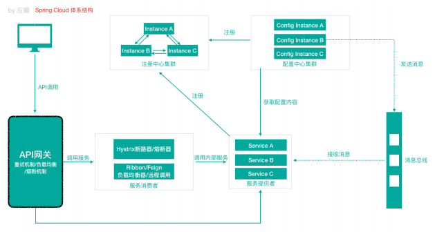

> 第一代 Spring Cloud 很多组件停止更新了

### 微服务架构

#### Spring Cloud 是什么

> Spring Cloud是⼀系列框架的有序集合（Spring Cloud是⼀个规范）
> 开发服务发现注册、配置中⼼、消息总线、负载均衡、断路器、数据监控等
> 利⽤Spring Boot的开发便利性简化了微服务架构的开发（⾃动装配）

SCN -> SCA

|  | 第⼀代 Spring Cloud（Netflix，SCN）| 第⼆代 Spring Cloud（主要就是 Spring Cloud Alibaba，SCA）|
| --- | --- | --- |
| 注册中⼼ | Netflix Eureka | 阿⾥巴巴 Nacos |
| 客户端 负载均衡 | Netflix Ribbon | 阿⾥巴巴 Dubbo LB、Spring Cloud Loadbalancer |
| 熔断器|  Netflix Hystrix | 阿⾥巴巴 Sentinel |
| ⽹关 | Netflix Zuul：性能⼀般，未来 将退出Spring Cloud ⽣态圈 | 官⽅ Spring Cloud Gateway |
| 配置中⼼ | 官⽅ Spring Cloud Config | 阿⾥巴巴 Nacos、携程 Apollo |
| 服务调⽤ | Netflix Feign | 阿⾥巴巴 Dubbo RPC |
| 消息驱动 | 官⽅ Spring Cloud Stream | --- |
| 链路追踪 | 官⽅ Spring Cloud Sleuth/Zipkin | 阿⾥巴巴 seata 分布式事务⽅案 |

### 服务注册中⼼

> 服务注册中⼼本质上是为了解耦服务提供者和服务消费者。

