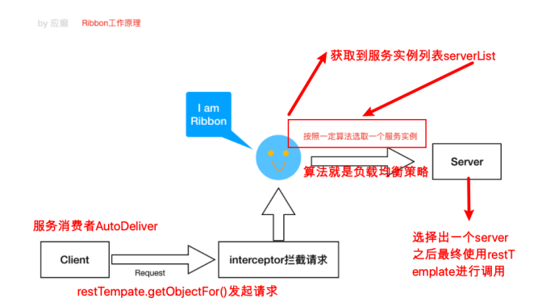

> 第一代 Spring Cloud 很多组件停止更新了

### 微服务架构

#### Spring Cloud 是什么

> Spring Cloud是⼀系列框架的有序集合（Spring Cloud是⼀个规范）
> 开发服务发现注册、配置中⼼、消息总线、负载均衡、断路器、数据监控等
> 利⽤Spring Boot的开发便利性简化了微服务架构的开发（⾃动装配）

SCN -> SCA

|  | 第⼀代 Spring Cloud（Netflix，SCN）| 第⼆代 Spring Cloud（主要就是 Spring Cloud Alibaba，SCA）|
| --- | --- | --- |
| 注册中⼼ | Netflix Eureka | 阿⾥巴巴 Nacos |
| 客户端 负载均衡 | Netflix Ribbon | 阿⾥巴巴 Dubbo LB、Spring Cloud Loadbalancer |
| 熔断器|  Netflix Hystrix | 阿⾥巴巴 Sentinel |
| ⽹关 | Netflix Zuul：性能⼀般，未来 将退出Spring Cloud ⽣态圈 | 官⽅ Spring Cloud Gateway |
| 配置中⼼ | 官⽅ Spring Cloud Config | 阿⾥巴巴 Nacos、携程 Apollo |
| 服务调⽤ | Netflix Feign | 阿⾥巴巴 Dubbo RPC |
| 消息驱动 | 官⽅ Spring Cloud Stream | --- |
| 链路追踪 | 官⽅ Spring Cloud Sleuth/Zipkin | 阿⾥巴巴 seata 分布式事务⽅案 |

### 服务注册中⼼

> 服务注册中⼼本质上是为了解耦服务提供者和服务消费者。

#### 主流服务中⼼对⽐

 - zookeeper 的存储和监听通知(偶数节点时如何保证选举成功???)
 - Eureka
 - Consul
 - Nacos

| 组件名 | 语⾔ | CAP | 对外暴露接⼝ |
| --- | --- | --- | --- |
| Eureka | Java | AP（⾃我保护机制，保证可⽤）| HTTP |
| Consul | Go | CP | HTTP/DNS |
| Zookeeper | Java | CP | 客户端 |
| Nacos | Java | ⽀持AP/CP切换 | HTTP |

### Eureka

Eureka Server HA⾼可⽤集群

什么时候用主机名什么时候用ip???

#### Eureka元数据详解

#### Eureka客户端详解

#### Eureka服务端详解

 - 服务下线
 - 失效剔除
 - ⾃我保护

### Ribbon负载均衡

服务器端负载均衡、谓客户端负载均衡

#### Ribbon负载均衡策略

| 负载均衡策略 | 描述 |
| --- | --- |
| RoundRobinRule：轮询策略 | 默认超过10次获取到的server都不可⽤，会返回⼀个空的server |
| RandomRule：随机策略 | 如果随机到的server为null或者不可⽤的话，会while不停的循环选取 |
| RetryRule：重试策略 | ⼀定时限内循环重试。默认继承RoundRobinRule，也⽀持⾃定义注⼊，RetryRule会在每次选取之后，对选举的server进⾏判断，是否为null，是否alive，并且在500ms内会不停的选取判断。⽽RoundRobinRule失效的策略是超过10次，RandomRule是没有失效时间的概念，只要serverList没都挂。 |
| BestAvailableRule：最⼩连接数策略 | 遍历serverList，选取出可⽤的且连接数最⼩的⼀个server。该算法⾥⾯有⼀个LoadBalancerStats的成员变量，会存储所有server的运⾏状况和连接数。如果选取到的server为null，那么会调⽤RoundRobinRule重新选取。1（1） 2（1）3（1） |
| AvailabilityFilteringRule：可⽤过滤策略 | 扩展了轮询策略，会先通过默认的轮询选取⼀个server，再去判断该server是否超时可⽤，当前连接数是否超限，都成功再返回。 |
| ZoneAvoidanceRule：区域权衡策略（默认策略） | 扩展了轮询策略，继承了2个过滤器：ZoneAvoidancePredicate和AvailabilityPredicate，除了过滤超时和链接数过多的server，还会过滤掉不符合要求的zone区域⾥⾯的所有节点，AWS --ZONE 在⼀个区域/机房内的服务实例中轮询 |

核心组件
 - IRule：是在选择实例的时候的负载均衡策略对象
 - IPing：是⽤来向服务发起⼼跳检测的，通过⼼跳检测来判断该服务是否可⽤
 - ServerListFilter：根据⼀些规则过滤传⼊的服务实例列表
 - ServerListUpdater：定义了⼀系列的对服务列表的更新操作

### Hystrix熔断器

