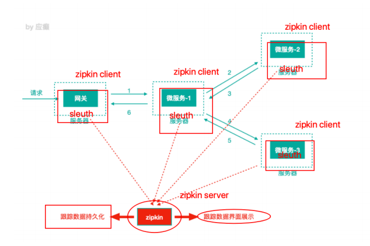

### 监控

#### 微服务监控之 Turbine 聚合监控

#### 微服务监控之分布式链路追踪技术 Sleuth + Zipkin

 - Trace ID
 - Span ID
   - CS ：client send/start 客户端/消费者发出⼀个请求，描述的是⼀个span开始
   - SR: server received/start 服务端/⽣产者接收请求 SR-CS属于请求发送的⽹络延迟
   - SS: server send/finish 服务端/⽣产者发送应答 SS-SR属于服务端消耗时间
   - CR：client received/finished 客户端/消费者接收应答 CR-SS表示回复需要的时间(响应的⽹络延迟)

有时候调用服务A有时候调用服务B，怎么解决???

各个服务器时间不一致是否会影响统计结果???

### 统一认证

密码明文传输有问题吗???

refresh_token 作用是什么???

### 第二代 Spring Cloud 核心组件

SCA 实用度不高：定位是阿里云，有些在阿里云上的组件是收费的

event-driven  message bus

#### nacos

服务注册
配置中心

#### Sentinel

面向云原生微服务的流量控制、熔断降级组件

