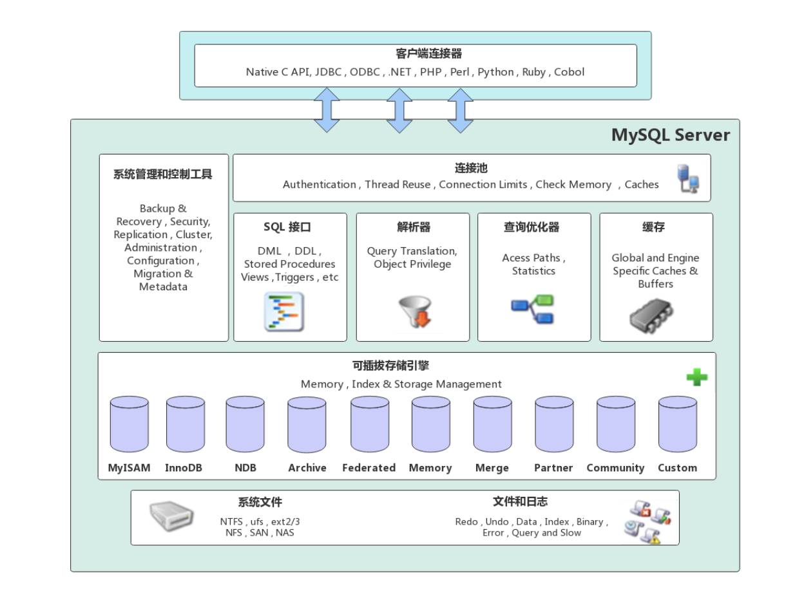
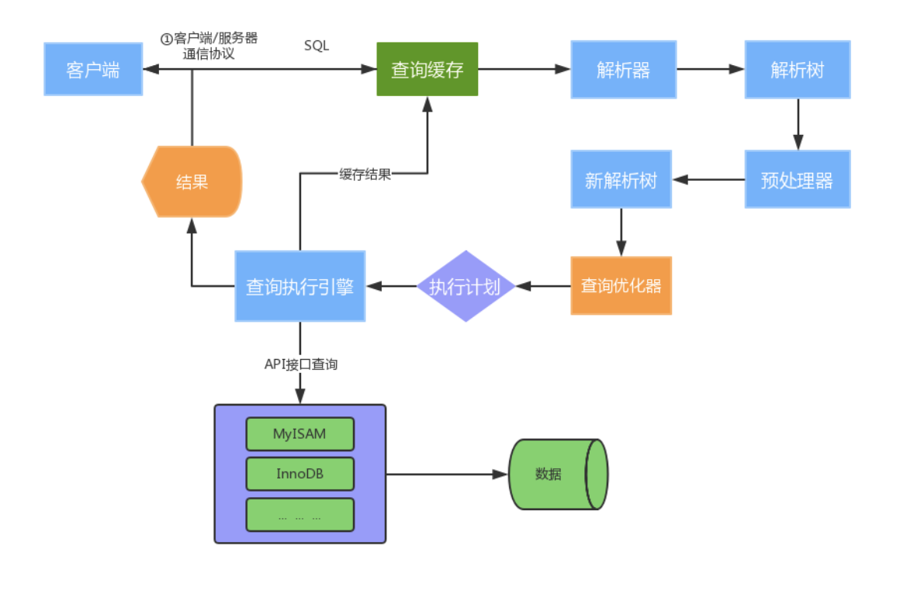

### MySQL

海豚 lago 的名字叫 Sakila

DDL、DML、DQL、TCL

IOE：IBM的服务器，Oracle数据库，EMC存储设备

#### MySQL应用架构演变

 - 架构V1.0 - 单机单库
 - 架构V2.0 - 主从架构
 - 架构V3.0 - 分库分表
 - 架构V4.0 - 云数据库

#### MySQL体系架构

 - 网络连接层
 - 服务层（MySQL Server）
 - 存储引擎层（Pluggable Storage Engines）
 - 系统文件层（File System）

半双工、全双工、单工

1. 建立连接
2. 查询缓存：缓存 select 的结果和语句，limit 1 会不会不一致???
3. 解析器：解析 SQL 语句，词法，语法分析
4. 查询优化器：
5. 查询执行引擎

InnoDB 和 MyISAM 的区别!!!0114???

#### InnoDB存储结构

自适应hash索引，查过的再次查询会非常快

什么叫 IO 操作???

